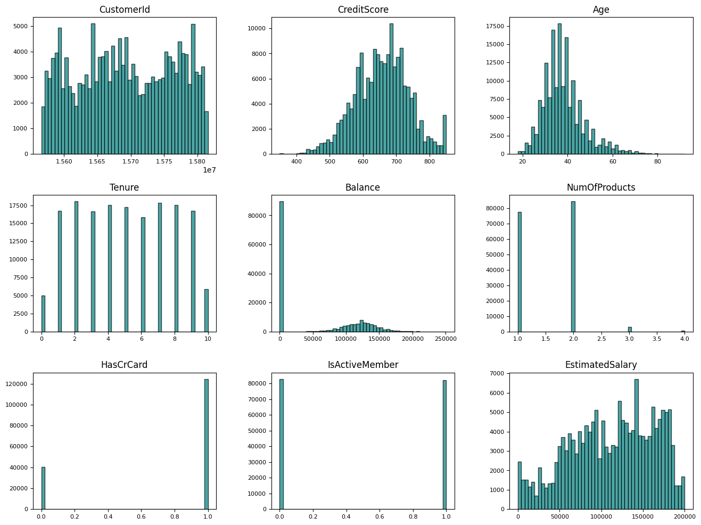
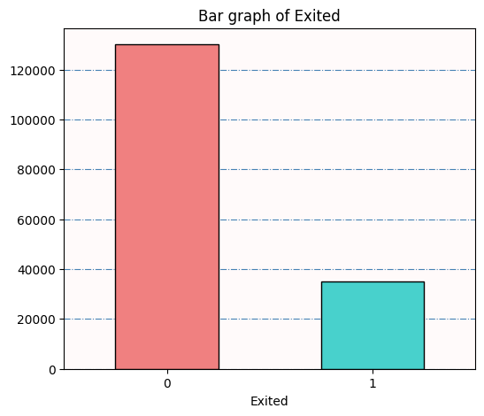
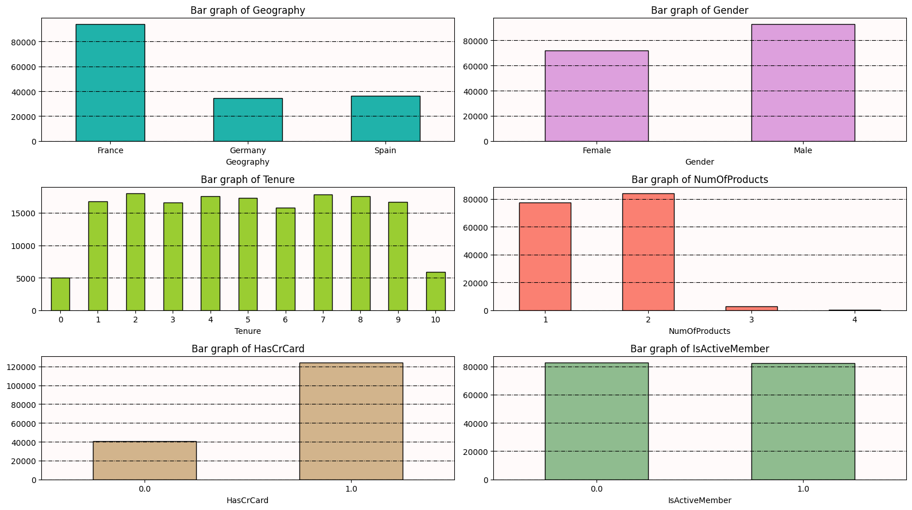
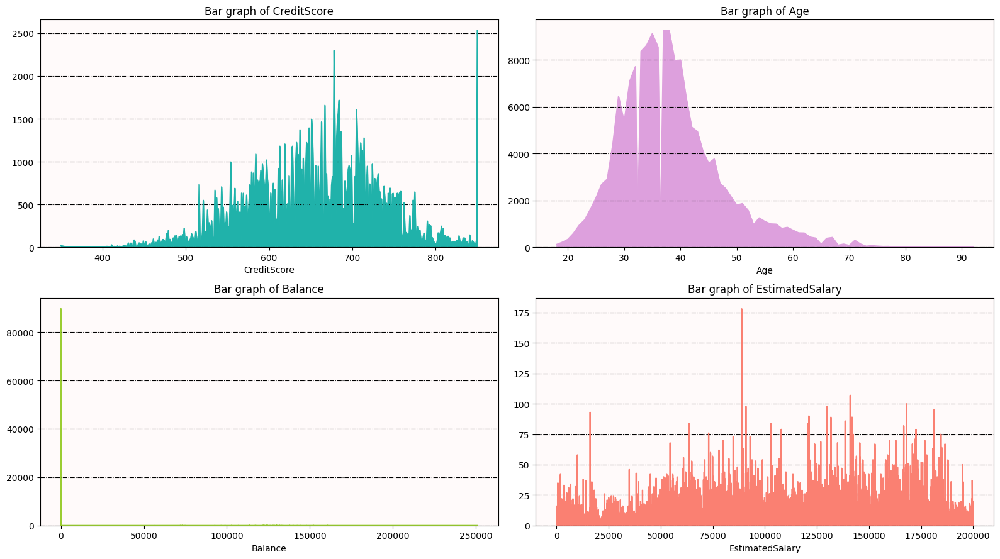
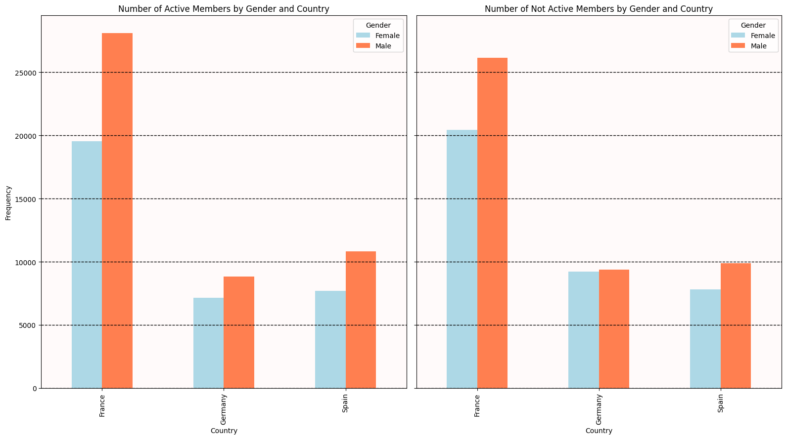
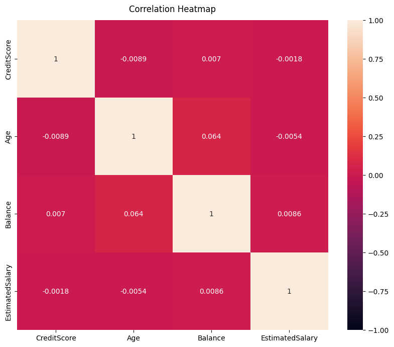
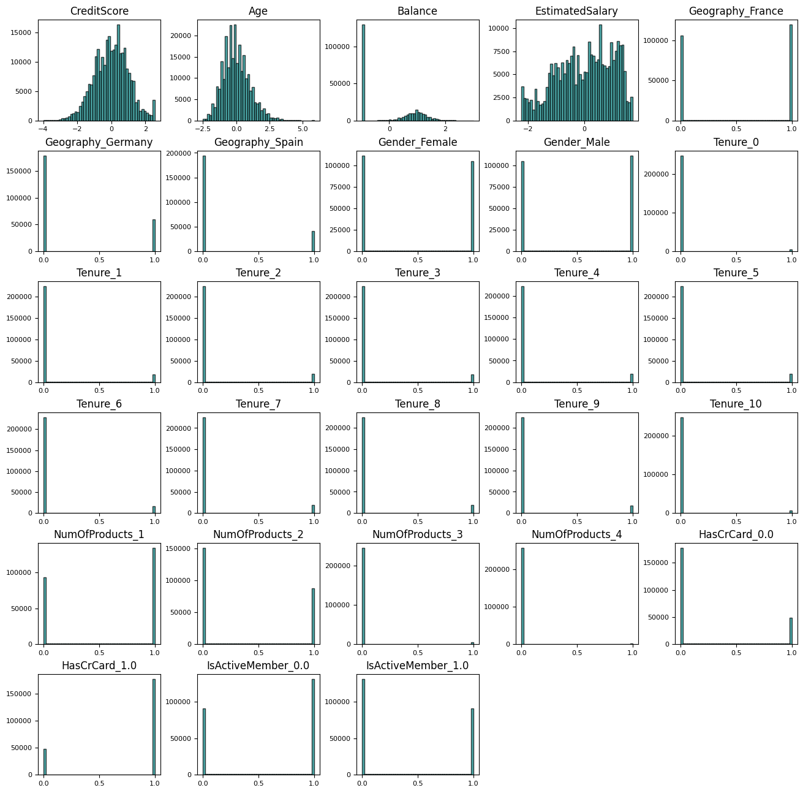

# Binary-Classification of Bank Churn-Dataset & Analaysis

# 1. Importing Libraries
* Importing all the required dependencies for the model.


```python
# Importing libraries
import os
import numpy as np
import pandas as pd
from scipy import stats
import seaborn as sns 
import matplotlib.pyplot as plt

# Importing scikit-learn preprocessing libraries
from sklearn.linear_model import SGDClassifier
from sklearn.preprocessing import StandardScaler
from sklearn.pipeline import make_pipeline
from imblearn.over_sampling import SMOTE

# Importing catboost and xgboost modeling libraries
from catboost import CatBoostClassifier
import xgboost as xgb
```

# 2. Importing Data Files
* Reading the `train.csv` and `test.csv file` from the given data path `/kaggle/input/spaceship-titanic/train.csv` and `/kaggle/input/spaceship-titanic/test.csv` loading it into variable X and X_test, using pd.read_csv as DataFrame.
* Calculating number of non-null values and data-type of every column in `X`, using `.info()`.


```python
# Read train Data file from the path
X = pd.read_csv("/kaggle/input/playground-series-s4e1/train.csv")
X.head(10)
```


<div>
<style scoped>
    .dataframe tbody tr th:only-of-type {
        vertical-align: middle;
    }

    .dataframe tbody tr th {
        vertical-align: top;
    }

    .dataframe thead th {
        text-align: right;
    }
</style>
<table border="1" class="dataframe">
  <thead>
    <tr style="text-align: right;">
      <th></th>
      <th>id</th>
      <th>CustomerId</th>
      <th>Surname</th>
      <th>CreditScore</th>
      <th>Geography</th>
      <th>Gender</th>
      <th>Age</th>
      <th>Tenure</th>
      <th>Balance</th>
      <th>NumOfProducts</th>
      <th>HasCrCard</th>
      <th>IsActiveMember</th>
      <th>EstimatedSalary</th>
      <th>Exited</th>
    </tr>
  </thead>
  <tbody>
    <tr>
      <th>0</th>
      <td>0</td>
      <td>15674932</td>
      <td>Okwudilichukwu</td>
      <td>668</td>
      <td>France</td>
      <td>Male</td>
      <td>33.0</td>
      <td>3</td>
      <td>0.00</td>
      <td>2</td>
      <td>1.0</td>
      <td>0.0</td>
      <td>181449.97</td>
      <td>0</td>
    </tr>
    <tr>
      <th>1</th>
      <td>1</td>
      <td>15749177</td>
      <td>Okwudiliolisa</td>
      <td>627</td>
      <td>France</td>
      <td>Male</td>
      <td>33.0</td>
      <td>1</td>
      <td>0.00</td>
      <td>2</td>
      <td>1.0</td>
      <td>1.0</td>
      <td>49503.50</td>
      <td>0</td>
    </tr>
    <tr>
      <th>2</th>
      <td>2</td>
      <td>15694510</td>
      <td>Hsueh</td>
      <td>678</td>
      <td>France</td>
      <td>Male</td>
      <td>40.0</td>
      <td>10</td>
      <td>0.00</td>
      <td>2</td>
      <td>1.0</td>
      <td>0.0</td>
      <td>184866.69</td>
      <td>0</td>
    </tr>
    <tr>
      <th>3</th>
      <td>3</td>
      <td>15741417</td>
      <td>Kao</td>
      <td>581</td>
      <td>France</td>
      <td>Male</td>
      <td>34.0</td>
      <td>2</td>
      <td>148882.54</td>
      <td>1</td>
      <td>1.0</td>
      <td>1.0</td>
      <td>84560.88</td>
      <td>0</td>
    </tr>
    <tr>
      <th>4</th>
      <td>4</td>
      <td>15766172</td>
      <td>Chiemenam</td>
      <td>716</td>
      <td>Spain</td>
      <td>Male</td>
      <td>33.0</td>
      <td>5</td>
      <td>0.00</td>
      <td>2</td>
      <td>1.0</td>
      <td>1.0</td>
      <td>15068.83</td>
      <td>0</td>
    </tr>
    <tr>
      <th>5</th>
      <td>5</td>
      <td>15771669</td>
      <td>Genovese</td>
      <td>588</td>
      <td>Germany</td>
      <td>Male</td>
      <td>36.0</td>
      <td>4</td>
      <td>131778.58</td>
      <td>1</td>
      <td>1.0</td>
      <td>0.0</td>
      <td>136024.31</td>
      <td>1</td>
    </tr>
    <tr>
      <th>6</th>
      <td>6</td>
      <td>15692819</td>
      <td>Ch'ang</td>
      <td>593</td>
      <td>France</td>
      <td>Female</td>
      <td>30.0</td>
      <td>8</td>
      <td>144772.69</td>
      <td>1</td>
      <td>1.0</td>
      <td>0.0</td>
      <td>29792.11</td>
      <td>0</td>
    </tr>
    <tr>
      <th>7</th>
      <td>7</td>
      <td>15669611</td>
      <td>Chukwuebuka</td>
      <td>678</td>
      <td>Spain</td>
      <td>Male</td>
      <td>37.0</td>
      <td>1</td>
      <td>138476.41</td>
      <td>1</td>
      <td>1.0</td>
      <td>0.0</td>
      <td>106851.60</td>
      <td>0</td>
    </tr>
    <tr>
      <th>8</th>
      <td>8</td>
      <td>15691707</td>
      <td>Manna</td>
      <td>676</td>
      <td>France</td>
      <td>Male</td>
      <td>43.0</td>
      <td>4</td>
      <td>0.00</td>
      <td>2</td>
      <td>1.0</td>
      <td>0.0</td>
      <td>142917.13</td>
      <td>0</td>
    </tr>
    <tr>
      <th>9</th>
      <td>9</td>
      <td>15591721</td>
      <td>Cattaneo</td>
      <td>583</td>
      <td>Germany</td>
      <td>Male</td>
      <td>40.0</td>
      <td>4</td>
      <td>81274.33</td>
      <td>1</td>
      <td>1.0</td>
      <td>1.0</td>
      <td>170843.07</td>
      <td>0</td>
    </tr>
  </tbody>
</table>
</div>


```python
# Print shape of the data frame
X.shape
```


    (165034, 14)


```python
# Checking non-null values and dtype of each column
X.info()
```

    <class 'pandas.core.frame.DataFrame'>
    RangeIndex: 165034 entries, 0 to 165033
    Data columns (total 14 columns):
     #   Column           Non-Null Count   Dtype  
    ---  ------           --------------   -----  
     0   id               165034 non-null  int64  
     1   CustomerId       165034 non-null  int64  
     2   Surname          165034 non-null  object 
     3   CreditScore      165034 non-null  int64  
     4   Geography        165034 non-null  object 
     5   Gender           165034 non-null  object 
     6   Age              165034 non-null  float64
     7   Tenure           165034 non-null  int64  
     8   Balance          165034 non-null  float64
     9   NumOfProducts    165034 non-null  int64  
     10  HasCrCard        165034 non-null  float64
     11  IsActiveMember   165034 non-null  float64
     12  EstimatedSalary  165034 non-null  float64
     13  Exited           165034 non-null  int64  
    dtypes: float64(5), int64(6), object(3)
    memory usage: 17.6+ MB
    


```python
# Calculating null values in each column
X.isnull().sum()
```


    id                 0
    CustomerId         0
    Surname            0
    CreditScore        0
    Geography          0
    Gender             0
    Age                0
    Tenure             0
    Balance            0
    NumOfProducts      0
    HasCrCard          0
    IsActiveMember     0
    EstimatedSalary    0
    Exited             0
    dtype: int64


# 3. Visualizing the Raw Data
* Listing down all the column names in `X`.
* Getting Descriptive analysis of `X` using `.describe()` and visualizing using `.hist()`.
* Ploting a bar-graph of the target variable `Exited`.
* Visualizing all Catagorical and Numerical columns through bar-graphs and line charts respectively.
* Comparing number of active and non-active customers based on their Gender and Geography.


```python
# Feature Data Columns
X.columns
```


    Index(['id', 'CustomerId', 'Surname', 'CreditScore', 'Geography', 'Gender',
           'Age', 'Tenure', 'Balance', 'NumOfProducts', 'HasCrCard',
           'IsActiveMember', 'EstimatedSalary', 'Exited'],
          dtype='object')


```python
# Data description
X.describe()
```


<div>
<style scoped>
    .dataframe tbody tr th:only-of-type {
        vertical-align: middle;
    }

    .dataframe tbody tr th {
        vertical-align: top;
    }

    .dataframe thead th {
        text-align: right;
    }
</style>
<table border="1" class="dataframe">
  <thead>
    <tr style="text-align: right;">
      <th></th>
      <th>id</th>
      <th>CustomerId</th>
      <th>CreditScore</th>
      <th>Age</th>
      <th>Tenure</th>
      <th>Balance</th>
      <th>NumOfProducts</th>
      <th>HasCrCard</th>
      <th>IsActiveMember</th>
      <th>EstimatedSalary</th>
      <th>Exited</th>
    </tr>
  </thead>
  <tbody>
    <tr>
      <th>count</th>
      <td>165034.0000</td>
      <td>1.650340e+05</td>
      <td>165034.000000</td>
      <td>165034.000000</td>
      <td>165034.000000</td>
      <td>165034.000000</td>
      <td>165034.000000</td>
      <td>165034.000000</td>
      <td>165034.000000</td>
      <td>165034.000000</td>
      <td>165034.000000</td>
    </tr>
    <tr>
      <th>mean</th>
      <td>82516.5000</td>
      <td>1.569201e+07</td>
      <td>656.454373</td>
      <td>38.125888</td>
      <td>5.020353</td>
      <td>55478.086689</td>
      <td>1.554455</td>
      <td>0.753954</td>
      <td>0.497770</td>
      <td>112574.822734</td>
      <td>0.211599</td>
    </tr>
    <tr>
      <th>std</th>
      <td>47641.3565</td>
      <td>7.139782e+04</td>
      <td>80.103340</td>
      <td>8.867205</td>
      <td>2.806159</td>
      <td>62817.663278</td>
      <td>0.547154</td>
      <td>0.430707</td>
      <td>0.499997</td>
      <td>50292.865585</td>
      <td>0.408443</td>
    </tr>
    <tr>
      <th>min</th>
      <td>0.0000</td>
      <td>1.556570e+07</td>
      <td>350.000000</td>
      <td>18.000000</td>
      <td>0.000000</td>
      <td>0.000000</td>
      <td>1.000000</td>
      <td>0.000000</td>
      <td>0.000000</td>
      <td>11.580000</td>
      <td>0.000000</td>
    </tr>
    <tr>
      <th>25%</th>
      <td>41258.2500</td>
      <td>1.563314e+07</td>
      <td>597.000000</td>
      <td>32.000000</td>
      <td>3.000000</td>
      <td>0.000000</td>
      <td>1.000000</td>
      <td>1.000000</td>
      <td>0.000000</td>
      <td>74637.570000</td>
      <td>0.000000</td>
    </tr>
    <tr>
      <th>50%</th>
      <td>82516.5000</td>
      <td>1.569017e+07</td>
      <td>659.000000</td>
      <td>37.000000</td>
      <td>5.000000</td>
      <td>0.000000</td>
      <td>2.000000</td>
      <td>1.000000</td>
      <td>0.000000</td>
      <td>117948.000000</td>
      <td>0.000000</td>
    </tr>
    <tr>
      <th>75%</th>
      <td>123774.7500</td>
      <td>1.575682e+07</td>
      <td>710.000000</td>
      <td>42.000000</td>
      <td>7.000000</td>
      <td>119939.517500</td>
      <td>2.000000</td>
      <td>1.000000</td>
      <td>1.000000</td>
      <td>155152.467500</td>
      <td>0.000000</td>
    </tr>
    <tr>
      <th>max</th>
      <td>165033.0000</td>
      <td>1.581569e+07</td>
      <td>850.000000</td>
      <td>92.000000</td>
      <td>10.000000</td>
      <td>250898.090000</td>
      <td>4.000000</td>
      <td>1.000000</td>
      <td>1.000000</td>
      <td>199992.480000</td>
      <td>1.000000</td>
    </tr>
  </tbody>
</table>
</div>


```python
# Histogram of Continious columns
cols = ['CustomerId', 'CreditScore', 'Age', 'Tenure', 'Balance', 'NumOfProducts', 'HasCrCard', 'IsActiveMember', 'EstimatedSalary']
ax = X[cols].hist(figsize=(16,12), bins=50, xlabelsize=8, ylabelsize=8, grid=False, color="teal", edgecolor='black', alpha=0.7);
```


    

    


```python
# Visualization of target (Transported) columns
target = "Exited"

fig, ax = plt.subplots(figsize=(6,5))
X[target].value_counts().sort_index().plot(kind='bar', ax=ax, color=["lightcoral", "mediumturquoise"], edgecolor='black')
ax.set_title(f"Bar graph of {target}")
ax.tick_params(axis='x', rotation=0)
ax.yaxis.grid(color='steelblue', linestyle="dashdot")
ax.set_facecolor(color="snow")
ax.set_axisbelow(True)
```


    

    


```python
# Visualization of Catagorical columns
cols = ["Geography", "Gender", "Tenure", "NumOfProducts", "HasCrCard", "IsActiveMember"]
color_list = ["lightseagreen", "plum", "yellowgreen", "salmon", "tan", "darkseagreen"]

fig, ax = plt.subplots(figsize=(16,9), nrows=3, ncols=2)

for i in range(0, 3):
    for j in range(0, 2):
        X[cols[2*i + j]].value_counts().sort_index().plot(kind='bar', ax=ax[i,j], color=color_list[2*i+j], edgecolor='k')
        ax[i, j].set_title(f"Bar graph of {cols[2*i+j]}")
        ax[i, j].tick_params(axis='x', rotation=0)
        ax[i, j].yaxis.grid(color='k', linestyle="dashdot")
        ax[i, j].set_facecolor(color="snow")

plt.tight_layout()
```


    

    


```python
# Visualization of Numerical columns
cols = ["CreditScore", "Age", "Balance", "EstimatedSalary"]
color_list = ["lightseagreen", "plum", "yellowgreen", "salmon", "tan", "darkseagreen"]

fig, ax = plt.subplots(figsize=(16,9), nrows=2, ncols=2)

for i in range(0, 2):
    for j in range(0, 2):
        X[cols[2*i + j]].value_counts().sort_index().plot(kind="area", ax=ax[i,j], color=color_list[2*i+j])
        ax[i, j].set_title(f"Bar graph of {cols[2*i+j]}")
        ax[i, j].tick_params(axis='x', rotation=0)
        ax[i, j].yaxis.grid(color='k', linestyle="dashdot")
        ax[i, j].set_facecolor(color="snow")

plt.tight_layout()
```


    

    


```python
# Filter X for Gender, Geography & IsAcitveMember columns
gender_geo_active = X[['Gender', 'Geography', 'IsActiveMember']]

fig, ax = plt.subplots(nrows=1, ncols=2, figsize=(16, 9), sharey='row')

active_counts = gender_geo_active[gender_geo_active['IsActiveMember'] == 1].groupby(['Geography', 'Gender']).size().unstack()
active_counts.plot(kind='bar', color=['lightblue', 'coral'], ax=ax[0])
ax[0].set_title('Number of Active Members by Gender and Country')
ax[0].set_xlabel('Country')
ax[0].set_ylabel('Frequency')
ax[0].yaxis.grid(color='k', linestyle='--', linewidth=1)
ax[0].legend(title='Gender')
ax[0].set_facecolor(color="snow")

not_active_counts = gender_geo_active[gender_geo_active['IsActiveMember'] == 0].groupby(['Geography', 'Gender']).size().unstack()
not_active_counts.plot(kind='bar', color=['lightblue', 'coral'], ax=ax[1])
ax[1].set_title('Number of Not Active Members by Gender and Country')
ax[1].set_xlabel('Country')
ax[1].set_ylabel('Frequency')
ax[1].yaxis.grid(color='k', linestyle='--', linewidth=1)
ax[1].legend(title='Gender')
ax[1].set_facecolor(color="snow")

plt.tight_layout()
plt.show()
```


    

    


# 4. Pre-Processing Data
* Calculating and listing down all the unique values and their counts for each columns in the dataframe `X`.


```python
# Printing Unique values and their counts for each column
for i in X.columns:
    print(f"\n{i}")
    print(f"{X[i].unique()}")
    print(f"Count of Unique Values: {X[i].unique().shape[0]}")
```

    
    id
    [     0      1      2 ... 165031 165032 165033]
    Count of Unique Values: 165034
    
    CustomerId
    [15674932 15749177 15694510 ... 15673571 15692656 15815050]
    Count of Unique Values: 23221
    
    Surname
    ['Okwudilichukwu' 'Okwudiliolisa' 'Hsueh' ... 'Aliyev' 'McMinn' 'Elkins']
    Count of Unique Values: 2797
    
    CreditScore
    [668 627 678 581 716 588 593 676 583 599 687 759 681 703 549 602 636 645
     559 773 554 553 714 616 586 785 834 632 746 797 753 749 413 611 752 551
     747 683 684 696 591 488 685 579 607 742 677 461 634 647 577 809 686 633
     494 699 663 756 648 563 682 620 721 652 535 584 701 640 711 707 631 637
     622 775 817 592 743 726 431 571 659 639 618 722 712 672 804 730 506 569
     558 507 594 796 615 619 471 434 706 758 762 635 630 709 661 644 731 748
     613 727 649 835 587 765 667 479 850 674 715 655 723 590 539 788 359 660
     517 740 694 578 610 718 705 542 624 601 625 596 770 695 662 567 744 595
     736 724 751 646 670 741 543 754 691 641 679 523 621 589 582 642 600 732
     698 469 525 520 470 692 532 651 605 792 638 671 540 821 822 557 689 521
     604 628 568 597 556 449 717 713 536 657 452 719 564 484 816 825 512 531
     818 745 527 774 738 547 708 603 725 477 680 443 562 580 729 710 574 447
     497 656 550 766 728 653 537 609 704 772 781 697 428 757 666 522 453 643
     612 501 585 735 510 544 565 755 505 838 688 626 548 545 769 733 560 437
     690 496 415 782 786 693 673 737 614 529 575 487 675 492 658 617 805 573
     561 629 502 826 516 779 794 472 829 812 533 669 843 598 451 572 489 538
     771 570 665 734 566 526 450 815 468 576 837 493 508 814 623 608 530 427
     841 767 650 824 830 720 534 763 750 819 459 519 790 739 606 778 518 509
     466 654 485 823 800 846 784 811 467 528 438 803 552 807 828 504 801 764
     806 473 458 833 783 444 848 791 702 439 546 464 367 768 845 524 795 474
     810 832 420 490 513 541 776 514 836 555 760 777 802 482 503 411 813 808
     700 456 515 664 844 840 429 820 486 455 498 761 495 476 798 463 842 789
     475 780 799 787 827 424 441 847 478 511 430 399 481 462 442 446 426 491
     425 849 435 793 500 831 408 483 405 445 499 457 440 480 839 401 416 433
     363 422 454 350 432 465 418 404 417 376 436 365 410 414 419 460 421 386
     383 412 358 448 423 382 373]
    Count of Unique Values: 457
    
    Geography
    ['France' 'Spain' 'Germany']
    Count of Unique Values: 3
    
    Gender
    ['Male' 'Female']
    Count of Unique Values: 2
    
    Age
    [33.   40.   34.   36.   30.   37.   43.   27.   71.   47.   25.   55.
     61.   35.   41.   44.   26.   39.   31.   58.   49.   32.   50.   28.
     45.   52.   29.   38.   54.   56.   46.   42.   64.   20.   21.   23.
     48.   59.   51.   24.   53.   62.   57.   22.   66.   67.   19.   73.
     60.   63.   65.   75.   68.   69.   76.   18.   70.   81.   74.   72.
     77.   82.   79.   92.   80.   78.   83.   36.44 85.   32.34 84.  ]
    Count of Unique Values: 71
    
    Tenure
    [ 3  1 10  2  5  4  8  6  9  7  0]
    Count of Unique Values: 11
    
    Balance
    [     0.   148882.54 131778.58 ... 117412.34 134937.1  110993.29]
    Count of Unique Values: 30075
    
    NumOfProducts
    [2 1 3 4]
    Count of Unique Values: 4
    
    HasCrCard
    [1. 0.]
    Count of Unique Values: 2
    
    IsActiveMember
    [0. 1.]
    Count of Unique Values: 2
    
    EstimatedSalary
    [181449.97  49503.5  184866.69 ... 167558.27   5962.5   71173.03]
    Count of Unique Values: 55298
    
    Exited
    [0 1]
    Count of Unique Values: 2
    

## (i). Removing Unwanted Columns
* Columns `id`, `CustomerId`, and `Surname` do not cotribute in makeing the decision for the target variable.
* Ploting a heatmap of `correlation` between every column.


```python
X = X.drop(columns=["id", "CustomerId", "Surname"])
```


```python
# Increase the size of the heatmap.
sns.color_palette("mako", as_cmap=True)
plt.figure(figsize=(10, 8))
heatmap = sns.heatmap(X[cols].corr(), vmin=-1, vmax=1, annot=True)
heatmap.set_title('Correlation Heatmap', fontdict={'fontsize':12}, pad=12);
```


    

    


## (ii).Transforming Data
### (a). X_train
* Converting the catagorical columns (`Geography`, `Gender`, `Tenure`, `NumOfProducts`, `HasCrCard`, and `IsActiveMember`) into one-hot encoded form.
* We will split our data `X` into `X_train` and `y_train`.
* As our data is very biased we will apply `SMOTE`, to generate additional data to nullify the baisness in our data through `.fit_resample()` function.
* Applying `StandardScaler` to normalize the numberical columns of the data.
* Visualizing the final `X_train`.


```python
# One-hot encoding
X = pd.get_dummies(X, columns=["Geography", "Gender", "Tenure", "NumOfProducts", "HasCrCard", "IsActiveMember"], dtype=float)
```


```python
# Seperating the target column from X_train
y_train = X["Exited"]
X_train = X.drop(columns=["Exited"])

X_train.head(5)
```


<div>
<style scoped>
    .dataframe tbody tr th:only-of-type {
        vertical-align: middle;
    }

    .dataframe tbody tr th {
        vertical-align: top;
    }

    .dataframe thead th {
        text-align: right;
    }
</style>
<table border="1" class="dataframe">
  <thead>
    <tr style="text-align: right;">
      <th></th>
      <th>CreditScore</th>
      <th>Age</th>
      <th>Balance</th>
      <th>EstimatedSalary</th>
      <th>Geography_France</th>
      <th>Geography_Germany</th>
      <th>Geography_Spain</th>
      <th>Gender_Female</th>
      <th>Gender_Male</th>
      <th>Tenure_0</th>
      <th>...</th>
      <th>Tenure_9</th>
      <th>Tenure_10</th>
      <th>NumOfProducts_1</th>
      <th>NumOfProducts_2</th>
      <th>NumOfProducts_3</th>
      <th>NumOfProducts_4</th>
      <th>HasCrCard_0.0</th>
      <th>HasCrCard_1.0</th>
      <th>IsActiveMember_0.0</th>
      <th>IsActiveMember_1.0</th>
    </tr>
  </thead>
  <tbody>
    <tr>
      <th>0</th>
      <td>668</td>
      <td>33.0</td>
      <td>0.00</td>
      <td>181449.97</td>
      <td>1.0</td>
      <td>0.0</td>
      <td>0.0</td>
      <td>0.0</td>
      <td>1.0</td>
      <td>0.0</td>
      <td>...</td>
      <td>0.0</td>
      <td>0.0</td>
      <td>0.0</td>
      <td>1.0</td>
      <td>0.0</td>
      <td>0.0</td>
      <td>0.0</td>
      <td>1.0</td>
      <td>1.0</td>
      <td>0.0</td>
    </tr>
    <tr>
      <th>1</th>
      <td>627</td>
      <td>33.0</td>
      <td>0.00</td>
      <td>49503.50</td>
      <td>1.0</td>
      <td>0.0</td>
      <td>0.0</td>
      <td>0.0</td>
      <td>1.0</td>
      <td>0.0</td>
      <td>...</td>
      <td>0.0</td>
      <td>0.0</td>
      <td>0.0</td>
      <td>1.0</td>
      <td>0.0</td>
      <td>0.0</td>
      <td>0.0</td>
      <td>1.0</td>
      <td>0.0</td>
      <td>1.0</td>
    </tr>
    <tr>
      <th>2</th>
      <td>678</td>
      <td>40.0</td>
      <td>0.00</td>
      <td>184866.69</td>
      <td>1.0</td>
      <td>0.0</td>
      <td>0.0</td>
      <td>0.0</td>
      <td>1.0</td>
      <td>0.0</td>
      <td>...</td>
      <td>0.0</td>
      <td>1.0</td>
      <td>0.0</td>
      <td>1.0</td>
      <td>0.0</td>
      <td>0.0</td>
      <td>0.0</td>
      <td>1.0</td>
      <td>1.0</td>
      <td>0.0</td>
    </tr>
    <tr>
      <th>3</th>
      <td>581</td>
      <td>34.0</td>
      <td>148882.54</td>
      <td>84560.88</td>
      <td>1.0</td>
      <td>0.0</td>
      <td>0.0</td>
      <td>0.0</td>
      <td>1.0</td>
      <td>0.0</td>
      <td>...</td>
      <td>0.0</td>
      <td>0.0</td>
      <td>1.0</td>
      <td>0.0</td>
      <td>0.0</td>
      <td>0.0</td>
      <td>0.0</td>
      <td>1.0</td>
      <td>0.0</td>
      <td>1.0</td>
    </tr>
    <tr>
      <th>4</th>
      <td>716</td>
      <td>33.0</td>
      <td>0.00</td>
      <td>15068.83</td>
      <td>0.0</td>
      <td>0.0</td>
      <td>1.0</td>
      <td>0.0</td>
      <td>1.0</td>
      <td>0.0</td>
      <td>...</td>
      <td>0.0</td>
      <td>0.0</td>
      <td>0.0</td>
      <td>1.0</td>
      <td>0.0</td>
      <td>0.0</td>
      <td>0.0</td>
      <td>1.0</td>
      <td>0.0</td>
      <td>1.0</td>
    </tr>
  </tbody>
</table>
<p>5 rows × 28 columns</p>
</div>


```python
# Applying SMOTE to resample our data
smote = SMOTE()
X_train, y_train = smote.fit_resample(X_train, y_train)
print(X_train.shape, y_train.shape)
```

    (260226, 28) (260226,)
    


```python
# Applying Standard-Scaler
cont_col = ["CreditScore", "Age", "Balance", "EstimatedSalary"]
scaler = StandardScaler()
X_train[cont_col] = scaler.fit_transform(X_train[cont_col])
```


```python
X_train
```


<div>
<style scoped>
    .dataframe tbody tr th:only-of-type {
        vertical-align: middle;
    }

    .dataframe tbody tr th {
        vertical-align: top;
    }

    .dataframe thead th {
        text-align: right;
    }
</style>
<table border="1" class="dataframe">
  <thead>
    <tr style="text-align: right;">
      <th></th>
      <th>CreditScore</th>
      <th>Age</th>
      <th>Balance</th>
      <th>EstimatedSalary</th>
      <th>Geography_France</th>
      <th>Geography_Germany</th>
      <th>Geography_Spain</th>
      <th>Gender_Female</th>
      <th>Gender_Male</th>
      <th>Tenure_0</th>
      <th>...</th>
      <th>Tenure_9</th>
      <th>Tenure_10</th>
      <th>NumOfProducts_1</th>
      <th>NumOfProducts_2</th>
      <th>NumOfProducts_3</th>
      <th>NumOfProducts_4</th>
      <th>HasCrCard_0.0</th>
      <th>HasCrCard_1.0</th>
      <th>IsActiveMember_0.0</th>
      <th>IsActiveMember_1.0</th>
    </tr>
  </thead>
  <tbody>
    <tr>
      <th>0</th>
      <td>0.174670</td>
      <td>-0.822875</td>
      <td>-0.968018</td>
      <td>1.355571</td>
      <td>1.000000</td>
      <td>0.00000</td>
      <td>0.000000</td>
      <td>0.000000</td>
      <td>1.000000</td>
      <td>0.00000</td>
      <td>...</td>
      <td>0.0</td>
      <td>0.0</td>
      <td>0.000000</td>
      <td>1.0</td>
      <td>0.0</td>
      <td>0.000000</td>
      <td>0.000000</td>
      <td>1.000000</td>
      <td>1.00000</td>
      <td>0.00000</td>
    </tr>
    <tr>
      <th>1</th>
      <td>-0.361966</td>
      <td>-0.822875</td>
      <td>-0.968018</td>
      <td>-1.262537</td>
      <td>1.000000</td>
      <td>0.00000</td>
      <td>0.000000</td>
      <td>0.000000</td>
      <td>1.000000</td>
      <td>0.00000</td>
      <td>...</td>
      <td>0.0</td>
      <td>0.0</td>
      <td>0.000000</td>
      <td>1.0</td>
      <td>0.0</td>
      <td>0.000000</td>
      <td>0.000000</td>
      <td>1.000000</td>
      <td>0.00000</td>
      <td>1.00000</td>
    </tr>
    <tr>
      <th>2</th>
      <td>0.305557</td>
      <td>-0.029185</td>
      <td>-0.968018</td>
      <td>1.423366</td>
      <td>1.000000</td>
      <td>0.00000</td>
      <td>0.000000</td>
      <td>0.000000</td>
      <td>1.000000</td>
      <td>0.00000</td>
      <td>...</td>
      <td>0.0</td>
      <td>1.0</td>
      <td>0.000000</td>
      <td>1.0</td>
      <td>0.0</td>
      <td>0.000000</td>
      <td>0.000000</td>
      <td>1.000000</td>
      <td>1.00000</td>
      <td>0.00000</td>
    </tr>
    <tr>
      <th>3</th>
      <td>-0.964044</td>
      <td>-0.709490</td>
      <td>1.386452</td>
      <td>-0.566921</td>
      <td>1.000000</td>
      <td>0.00000</td>
      <td>0.000000</td>
      <td>0.000000</td>
      <td>1.000000</td>
      <td>0.00000</td>
      <td>...</td>
      <td>0.0</td>
      <td>0.0</td>
      <td>1.000000</td>
      <td>0.0</td>
      <td>0.0</td>
      <td>0.000000</td>
      <td>0.000000</td>
      <td>1.000000</td>
      <td>0.00000</td>
      <td>1.00000</td>
    </tr>
    <tr>
      <th>4</th>
      <td>0.802926</td>
      <td>-0.822875</td>
      <td>-0.968018</td>
      <td>-1.945796</td>
      <td>0.000000</td>
      <td>0.00000</td>
      <td>1.000000</td>
      <td>0.000000</td>
      <td>1.000000</td>
      <td>0.00000</td>
      <td>...</td>
      <td>0.0</td>
      <td>0.0</td>
      <td>0.000000</td>
      <td>1.0</td>
      <td>0.0</td>
      <td>0.000000</td>
      <td>0.000000</td>
      <td>1.000000</td>
      <td>0.00000</td>
      <td>1.00000</td>
    </tr>
    <tr>
      <th>...</th>
      <td>...</td>
      <td>...</td>
      <td>...</td>
      <td>...</td>
      <td>...</td>
      <td>...</td>
      <td>...</td>
      <td>...</td>
      <td>...</td>
      <td>...</td>
      <td>...</td>
      <td>...</td>
      <td>...</td>
      <td>...</td>
      <td>...</td>
      <td>...</td>
      <td>...</td>
      <td>...</td>
      <td>...</td>
      <td>...</td>
      <td>...</td>
    </tr>
    <tr>
      <th>260221</th>
      <td>-0.231079</td>
      <td>-0.022637</td>
      <td>-0.968018</td>
      <td>-1.203830</td>
      <td>1.000000</td>
      <td>0.00000</td>
      <td>0.000000</td>
      <td>0.490376</td>
      <td>0.509624</td>
      <td>0.00000</td>
      <td>...</td>
      <td>0.0</td>
      <td>0.0</td>
      <td>1.000000</td>
      <td>0.0</td>
      <td>0.0</td>
      <td>0.000000</td>
      <td>0.000000</td>
      <td>1.000000</td>
      <td>1.00000</td>
      <td>0.00000</td>
    </tr>
    <tr>
      <th>260222</th>
      <td>0.488798</td>
      <td>-0.365840</td>
      <td>0.923098</td>
      <td>-1.274646</td>
      <td>1.000000</td>
      <td>0.00000</td>
      <td>0.000000</td>
      <td>0.343615</td>
      <td>0.656385</td>
      <td>0.00000</td>
      <td>...</td>
      <td>0.0</td>
      <td>0.0</td>
      <td>1.000000</td>
      <td>0.0</td>
      <td>0.0</td>
      <td>0.000000</td>
      <td>0.000000</td>
      <td>1.000000</td>
      <td>1.00000</td>
      <td>0.00000</td>
    </tr>
    <tr>
      <th>260223</th>
      <td>-1.042576</td>
      <td>1.287306</td>
      <td>-0.968018</td>
      <td>-1.739844</td>
      <td>1.000000</td>
      <td>0.00000</td>
      <td>0.000000</td>
      <td>1.000000</td>
      <td>0.000000</td>
      <td>0.00000</td>
      <td>...</td>
      <td>0.0</td>
      <td>0.0</td>
      <td>1.000000</td>
      <td>0.0</td>
      <td>0.0</td>
      <td>0.000000</td>
      <td>0.077174</td>
      <td>0.922826</td>
      <td>0.00000</td>
      <td>1.00000</td>
    </tr>
    <tr>
      <th>260224</th>
      <td>0.279379</td>
      <td>0.745377</td>
      <td>1.040521</td>
      <td>-0.231974</td>
      <td>0.584349</td>
      <td>0.00000</td>
      <td>0.415651</td>
      <td>1.000000</td>
      <td>0.000000</td>
      <td>0.00000</td>
      <td>...</td>
      <td>0.0</td>
      <td>0.0</td>
      <td>0.584349</td>
      <td>0.0</td>
      <td>0.0</td>
      <td>0.415651</td>
      <td>0.584349</td>
      <td>0.415651</td>
      <td>0.00000</td>
      <td>1.00000</td>
    </tr>
    <tr>
      <th>260225</th>
      <td>-1.644655</td>
      <td>-0.125261</td>
      <td>1.259544</td>
      <td>0.940789</td>
      <td>0.847350</td>
      <td>0.15265</td>
      <td>0.000000</td>
      <td>0.152650</td>
      <td>0.847350</td>
      <td>0.15265</td>
      <td>...</td>
      <td>0.0</td>
      <td>0.0</td>
      <td>1.000000</td>
      <td>0.0</td>
      <td>0.0</td>
      <td>0.000000</td>
      <td>1.000000</td>
      <td>0.000000</td>
      <td>0.84735</td>
      <td>0.15265</td>
    </tr>
  </tbody>
</table>
<p>260226 rows × 28 columns</p>
</div>


```python
# Visualizing the final `X_train`.
ax = X_train.hist(figsize=(16,16), bins=50, xlabelsize=8, ylabelsize=8, grid=False, color="teal", edgecolor='black', alpha=0.7);
```


    

    


### (b). X_test
* Retriving `id` from `X_trian` and droping from `X_train` because it will not contribute in prediction.
* Perform similar transformation as we applied to `X_train`, so that we can fit it properly in the model.


```python
# Read train Data file from the path
X_test = pd.read_csv("/kaggle/input/playground-series-s4e1/test.csv")

# Retriving `id` from `X_trian` and droping from `X_train`
id_ = X_test["id"]
X_test.drop(columns=["id"], inplace=True)
X_test.head()
```


<div>
<style scoped>
    .dataframe tbody tr th:only-of-type {
        vertical-align: middle;
    }

    .dataframe tbody tr th {
        vertical-align: top;
    }

    .dataframe thead th {
        text-align: right;
    }
</style>
<table border="1" class="dataframe">
  <thead>
    <tr style="text-align: right;">
      <th></th>
      <th>CustomerId</th>
      <th>Surname</th>
      <th>CreditScore</th>
      <th>Geography</th>
      <th>Gender</th>
      <th>Age</th>
      <th>Tenure</th>
      <th>Balance</th>
      <th>NumOfProducts</th>
      <th>HasCrCard</th>
      <th>IsActiveMember</th>
      <th>EstimatedSalary</th>
    </tr>
  </thead>
  <tbody>
    <tr>
      <th>0</th>
      <td>15773898</td>
      <td>Lucchese</td>
      <td>586</td>
      <td>France</td>
      <td>Female</td>
      <td>23.0</td>
      <td>2</td>
      <td>0.00</td>
      <td>2</td>
      <td>0.0</td>
      <td>1.0</td>
      <td>160976.75</td>
    </tr>
    <tr>
      <th>1</th>
      <td>15782418</td>
      <td>Nott</td>
      <td>683</td>
      <td>France</td>
      <td>Female</td>
      <td>46.0</td>
      <td>2</td>
      <td>0.00</td>
      <td>1</td>
      <td>1.0</td>
      <td>0.0</td>
      <td>72549.27</td>
    </tr>
    <tr>
      <th>2</th>
      <td>15807120</td>
      <td>K?</td>
      <td>656</td>
      <td>France</td>
      <td>Female</td>
      <td>34.0</td>
      <td>7</td>
      <td>0.00</td>
      <td>2</td>
      <td>1.0</td>
      <td>0.0</td>
      <td>138882.09</td>
    </tr>
    <tr>
      <th>3</th>
      <td>15808905</td>
      <td>O'Donnell</td>
      <td>681</td>
      <td>France</td>
      <td>Male</td>
      <td>36.0</td>
      <td>8</td>
      <td>0.00</td>
      <td>1</td>
      <td>1.0</td>
      <td>0.0</td>
      <td>113931.57</td>
    </tr>
    <tr>
      <th>4</th>
      <td>15607314</td>
      <td>Higgins</td>
      <td>752</td>
      <td>Germany</td>
      <td>Male</td>
      <td>38.0</td>
      <td>10</td>
      <td>121263.62</td>
      <td>1</td>
      <td>1.0</td>
      <td>0.0</td>
      <td>139431.00</td>
    </tr>
  </tbody>
</table>
</div>


```python
def test_transformer(df_X):
    
    # Removing unwanted columns and NaN valued records
    df_X.drop(columns=["CustomerId", "Surname"], inplace=True)

    # Converting catagorical columns to One-Hot Encoded form
    cols = ["Geography", "Gender", "Tenure", "NumOfProducts", "HasCrCard", "IsActiveMember"]
    df_X = pd.get_dummies(df_X, columns=cols, dtype=float)
    
    return df_X
```


```python
X_test = test_transformer(X_test)

# Applying scaler transform
X_test[cont_col] = scaler.transform(X_test[cont_col])
```


```python
X_test
```


<div>
<style scoped>
    .dataframe tbody tr th:only-of-type {
        vertical-align: middle;
    }

    .dataframe tbody tr th {
        vertical-align: top;
    }

    .dataframe thead th {
        text-align: right;
    }
</style>
<table border="1" class="dataframe">
  <thead>
    <tr style="text-align: right;">
      <th></th>
      <th>CreditScore</th>
      <th>Age</th>
      <th>Balance</th>
      <th>EstimatedSalary</th>
      <th>Geography_France</th>
      <th>Geography_Germany</th>
      <th>Geography_Spain</th>
      <th>Gender_Female</th>
      <th>Gender_Male</th>
      <th>Tenure_0</th>
      <th>...</th>
      <th>Tenure_9</th>
      <th>Tenure_10</th>
      <th>NumOfProducts_1</th>
      <th>NumOfProducts_2</th>
      <th>NumOfProducts_3</th>
      <th>NumOfProducts_4</th>
      <th>HasCrCard_0.0</th>
      <th>HasCrCard_1.0</th>
      <th>IsActiveMember_0.0</th>
      <th>IsActiveMember_1.0</th>
    </tr>
  </thead>
  <tbody>
    <tr>
      <th>0</th>
      <td>-0.898601</td>
      <td>-1.956717</td>
      <td>-0.968018</td>
      <td>0.949337</td>
      <td>1.0</td>
      <td>0.0</td>
      <td>0.0</td>
      <td>1.0</td>
      <td>0.0</td>
      <td>0.0</td>
      <td>...</td>
      <td>0.0</td>
      <td>0.0</td>
      <td>0.0</td>
      <td>1.0</td>
      <td>0.0</td>
      <td>0.0</td>
      <td>1.0</td>
      <td>0.0</td>
      <td>0.0</td>
      <td>1.0</td>
    </tr>
    <tr>
      <th>1</th>
      <td>0.371000</td>
      <td>0.651121</td>
      <td>-0.968018</td>
      <td>-0.805258</td>
      <td>1.0</td>
      <td>0.0</td>
      <td>0.0</td>
      <td>1.0</td>
      <td>0.0</td>
      <td>0.0</td>
      <td>...</td>
      <td>0.0</td>
      <td>0.0</td>
      <td>1.0</td>
      <td>0.0</td>
      <td>0.0</td>
      <td>0.0</td>
      <td>0.0</td>
      <td>1.0</td>
      <td>1.0</td>
      <td>0.0</td>
    </tr>
    <tr>
      <th>2</th>
      <td>0.017606</td>
      <td>-0.709490</td>
      <td>-0.968018</td>
      <td>0.510931</td>
      <td>1.0</td>
      <td>0.0</td>
      <td>0.0</td>
      <td>1.0</td>
      <td>0.0</td>
      <td>0.0</td>
      <td>...</td>
      <td>0.0</td>
      <td>0.0</td>
      <td>0.0</td>
      <td>1.0</td>
      <td>0.0</td>
      <td>0.0</td>
      <td>0.0</td>
      <td>1.0</td>
      <td>1.0</td>
      <td>0.0</td>
    </tr>
    <tr>
      <th>3</th>
      <td>0.344823</td>
      <td>-0.482722</td>
      <td>-0.968018</td>
      <td>0.015858</td>
      <td>1.0</td>
      <td>0.0</td>
      <td>0.0</td>
      <td>0.0</td>
      <td>1.0</td>
      <td>0.0</td>
      <td>...</td>
      <td>0.0</td>
      <td>0.0</td>
      <td>1.0</td>
      <td>0.0</td>
      <td>0.0</td>
      <td>0.0</td>
      <td>0.0</td>
      <td>1.0</td>
      <td>1.0</td>
      <td>0.0</td>
    </tr>
    <tr>
      <th>4</th>
      <td>1.274118</td>
      <td>-0.255953</td>
      <td>0.949678</td>
      <td>0.521822</td>
      <td>0.0</td>
      <td>1.0</td>
      <td>0.0</td>
      <td>0.0</td>
      <td>1.0</td>
      <td>0.0</td>
      <td>...</td>
      <td>0.0</td>
      <td>1.0</td>
      <td>1.0</td>
      <td>0.0</td>
      <td>0.0</td>
      <td>0.0</td>
      <td>0.0</td>
      <td>1.0</td>
      <td>1.0</td>
      <td>0.0</td>
    </tr>
    <tr>
      <th>...</th>
      <td>...</td>
      <td>...</td>
      <td>...</td>
      <td>...</td>
      <td>...</td>
      <td>...</td>
      <td>...</td>
      <td>...</td>
      <td>...</td>
      <td>...</td>
      <td>...</td>
      <td>...</td>
      <td>...</td>
      <td>...</td>
      <td>...</td>
      <td>...</td>
      <td>...</td>
      <td>...</td>
      <td>...</td>
      <td>...</td>
      <td>...</td>
    </tr>
    <tr>
      <th>110018</th>
      <td>-1.108020</td>
      <td>-1.276412</td>
      <td>0.868017</td>
      <td>0.693588</td>
      <td>0.0</td>
      <td>0.0</td>
      <td>1.0</td>
      <td>0.0</td>
      <td>1.0</td>
      <td>0.0</td>
      <td>...</td>
      <td>0.0</td>
      <td>0.0</td>
      <td>1.0</td>
      <td>0.0</td>
      <td>0.0</td>
      <td>0.0</td>
      <td>0.0</td>
      <td>1.0</td>
      <td>0.0</td>
      <td>1.0</td>
    </tr>
    <tr>
      <th>110019</th>
      <td>-1.042576</td>
      <td>-0.482722</td>
      <td>1.847438</td>
      <td>-1.407818</td>
      <td>1.0</td>
      <td>0.0</td>
      <td>0.0</td>
      <td>1.0</td>
      <td>0.0</td>
      <td>0.0</td>
      <td>...</td>
      <td>0.0</td>
      <td>0.0</td>
      <td>1.0</td>
      <td>0.0</td>
      <td>0.0</td>
      <td>0.0</td>
      <td>0.0</td>
      <td>1.0</td>
      <td>0.0</td>
      <td>1.0</td>
    </tr>
    <tr>
      <th>110020</th>
      <td>0.750571</td>
      <td>-1.049643</td>
      <td>-0.968018</td>
      <td>-1.921617</td>
      <td>1.0</td>
      <td>0.0</td>
      <td>0.0</td>
      <td>0.0</td>
      <td>1.0</td>
      <td>0.0</td>
      <td>...</td>
      <td>0.0</td>
      <td>0.0</td>
      <td>0.0</td>
      <td>1.0</td>
      <td>0.0</td>
      <td>0.0</td>
      <td>0.0</td>
      <td>1.0</td>
      <td>1.0</td>
      <td>0.0</td>
    </tr>
    <tr>
      <th>110021</th>
      <td>0.711305</td>
      <td>-0.936259</td>
      <td>-0.968018</td>
      <td>0.906475</td>
      <td>1.0</td>
      <td>0.0</td>
      <td>0.0</td>
      <td>1.0</td>
      <td>0.0</td>
      <td>0.0</td>
      <td>...</td>
      <td>0.0</td>
      <td>0.0</td>
      <td>1.0</td>
      <td>0.0</td>
      <td>0.0</td>
      <td>0.0</td>
      <td>0.0</td>
      <td>1.0</td>
      <td>0.0</td>
      <td>1.0</td>
    </tr>
    <tr>
      <th>110022</th>
      <td>-0.440498</td>
      <td>-0.369338</td>
      <td>0.421241</td>
      <td>-1.764404</td>
      <td>1.0</td>
      <td>0.0</td>
      <td>0.0</td>
      <td>1.0</td>
      <td>0.0</td>
      <td>0.0</td>
      <td>...</td>
      <td>0.0</td>
      <td>0.0</td>
      <td>1.0</td>
      <td>0.0</td>
      <td>0.0</td>
      <td>0.0</td>
      <td>0.0</td>
      <td>1.0</td>
      <td>1.0</td>
      <td>0.0</td>
    </tr>
  </tbody>
</table>
<p>110023 rows × 28 columns</p>
</div>


# 5. Modeling
* We have used CatBoostClassifier as our prediction model.
* Fiting the model with our training data `X_train` and `y_train`.


```python
# Creating CatBoostClassifier
model = CatBoostClassifier(iterations=2000, l2_leaf_reg=10)

# Fiting the model with our training data
model.fit(X_train, y_train, verbose=0)
```


    <catboost.core.CatBoostClassifier at 0x7c4ab82a0490>


```python
# Predicting the output probabilities
y_pred = model.predict_proba(X_test)[:,1]
print(y_pred)
```

    [0.02166391 0.84451622 0.02111232 ... 0.02247308 0.17164884 0.19364593]
    

# 6. Submission
* Storing `id` and `Exited` into a dictionary.


```python
data = {'id': id_,
        'Exited': y_pred}

submission = pd.DataFrame(data)
submission.to_csv('/kaggle/working/submission.csv', index=False)
submission
```


<div>
<style scoped>
    .dataframe tbody tr th:only-of-type {
        vertical-align: middle;
    }

    .dataframe tbody tr th {
        vertical-align: top;
    }

    .dataframe thead th {
        text-align: right;
    }
</style>
<table border="1" class="dataframe">
  <thead>
    <tr style="text-align: right;">
      <th></th>
      <th>id</th>
      <th>Exited</th>
    </tr>
  </thead>
  <tbody>
    <tr>
      <th>0</th>
      <td>165034</td>
      <td>0.021664</td>
    </tr>
    <tr>
      <th>1</th>
      <td>165035</td>
      <td>0.844516</td>
    </tr>
    <tr>
      <th>2</th>
      <td>165036</td>
      <td>0.021112</td>
    </tr>
    <tr>
      <th>3</th>
      <td>165037</td>
      <td>0.235985</td>
    </tr>
    <tr>
      <th>4</th>
      <td>165038</td>
      <td>0.392187</td>
    </tr>
    <tr>
      <th>...</th>
      <td>...</td>
      <td>...</td>
    </tr>
    <tr>
      <th>110018</th>
      <td>275052</td>
      <td>0.036697</td>
    </tr>
    <tr>
      <th>110019</th>
      <td>275053</td>
      <td>0.171998</td>
    </tr>
    <tr>
      <th>110020</th>
      <td>275054</td>
      <td>0.022473</td>
    </tr>
    <tr>
      <th>110021</th>
      <td>275055</td>
      <td>0.171649</td>
    </tr>
    <tr>
      <th>110022</th>
      <td>275056</td>
      <td>0.193646</td>
    </tr>
  </tbody>
</table>
<p>110023 rows × 2 columns</p>
</div>


```python

```
